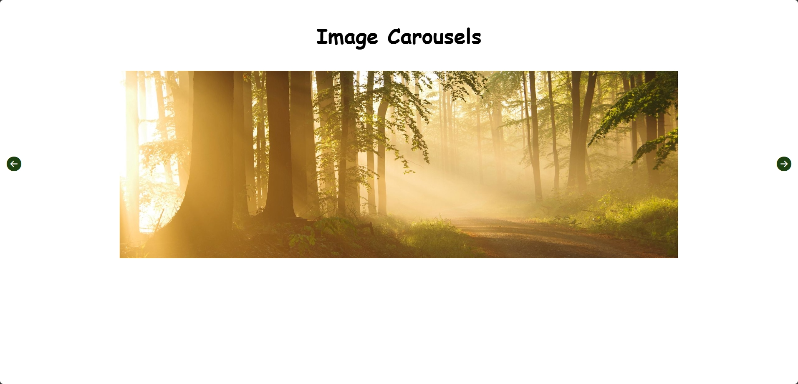

# Image Carousels 🖼

A collection of different image carousels styles. This mini-project demonstrates various approaches to implementing image sliders, from basic manual controls to subtle auto-playing animations.

## Features ✨

- **Basic Carousel**: Manual navigation with Next/Previous buttons and dot indicators.
- **Infinite Loop Carousel**: Seamless cycling through images without reaching an "end".
- **Responsive Design**: All carousels adapt smoothly to different screen sizes.

## Key Concepts Used 🧩

- DOM selection `document.querySelectorAll()`
- Dynamic Styling `style.display`
- Iteration `forEach`
- Array Properties `.length`
- Conditional logic `if / else`
- Event Handling `onclick`
- CSS Animations `@keyframes`

## Programming Languages Used 🛠️

- HTML
- CSS
- JavaScript

## Screenshot 📸

## Future Enhancements 🚀

- Add different types of carousels with animation like:
  - Thumbnail Carousel
  - Auto-Playing Carousel
